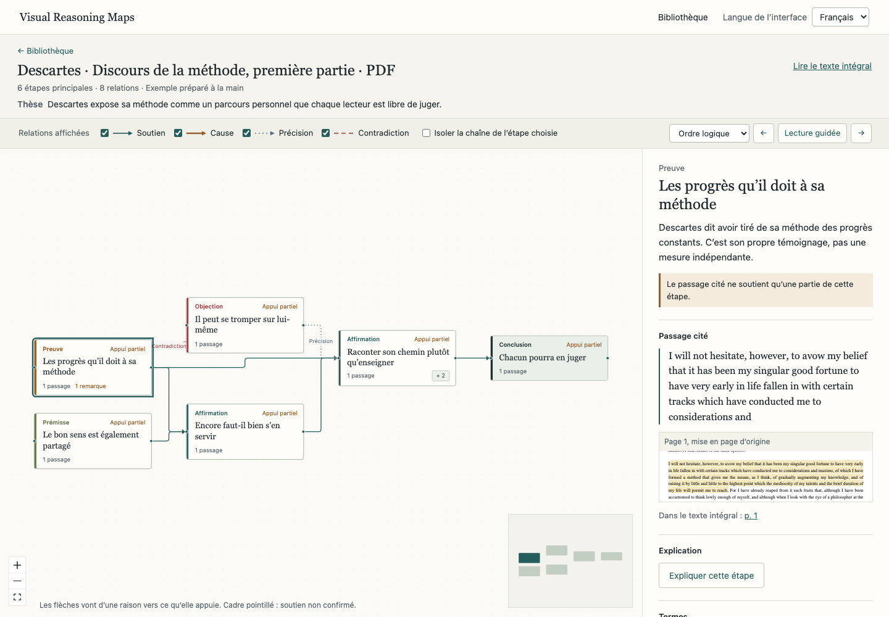
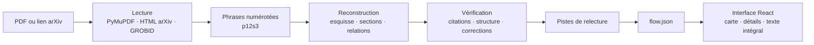

<div align="center">

# Visual Reasoning Maps

Carte du raisonnement d’un article scientifique, dont chaque étape renvoie aux phrases du texte qui la fondent.

[](https://github.com/YEKESONG/Visual_Reasoning_Maps/actions/workflows/ci.yml)
[](LICENSE)
[](pyproject.toml)
[](frontend/package.json)

[English](README.md) · **Français** · [中文](README.zh-CN.md)

</div>



Visual Reasoning Maps est un prototype de recherche réalisé pour un projet ENAC. À partir d’un article (PDF ou lien arXiv), un modèle de langage reconstruit l’argumentation : question, prémisses, affirmations, preuves, objections, conclusions et relations entre elles. Chaque étape et chaque relation citent les phrases du texte sur lesquelles elles reposent ; un contrôle automatique vérifie que ces phrases existent et qu’elles soutiennent bien ce qu’on leur attribue. L’application tourne en local, avec une interface en français, en anglais et en chinois. Le dépôt contient aussi un état de l’art en français (`paper/`).

> [!NOTE]
> Une carte est la lecture d’un texte par un modèle. Le statut « Vérifié » signifie que le passage cité soutient l’étape selon le contrôle automatique ; il ne dit rien de la validité scientifique de l’affirmation.

## Sommaire

- [Fonctionnalités](#fonctionnalités)
- [Démarrage rapide](#démarrage-rapide)
- [Utilisation](#utilisation)
- [Fonctionnement](#fonctionnement)
- [Configuration](#configuration)
- [API HTTP](#api-http)
- [Développement](#développement)
- [Docker](#docker)
- [Limites connues](#limites-connues)
- [Dépannage](#dépannage)
- [Contribuer](#contribuer)
- [Licence](#licence)

## Fonctionnalités

- **Import** d’un PDF (30 Mo et 400 pages au plus) ou d’un lien arXiv. Pour arXiv, la version HTML est préférée au PDF.
- **Carte hiérarchique** : 5 à 12 étapes principales, dépliables en sous-étapes, disposées de gauche à droite, des raisons vers les conclusions. Quatre relations (soutien, cause, précision, contradiction) se distinguent par la couleur et le trait.
- **Retour au texte** : pour une étape, les phrases citées, l’extrait dans la mise en page d’origine et le lien vers la page ; pour une relation, les deux passages côte à côte.
- **Contrôle des citations** : chaque étape et chaque relation reçoit le statut Vérifié, Appui partiel ou À vérifier. Les défauts de structure sont consignés dans un rapport.
- **Pistes de relecture** : affirmations sans appui, preuves qui n’appuient rien, conclusions qui vont plus loin que les éléments cités, contradictions à examiner.
- **Aides à la lecture** : lecture guidée dans l’ordre du raisonnement ou du texte, texte intégral avec passages surlignés, explication d’une étape à la demande, navigation au clavier.
- **Trois langues** : interface en français, anglais et chinois. La langue de la carte se choisit à l’import ; les citations restent dans la langue du document.
- **Données locales** : documents, cartes et journaux restent sur la machine. Seul le texte du document est envoyé au fournisseur du modèle.

## Démarrage rapide

### Prérequis

| Outil | Version | Remarque |
|---|---|---|
| Python | 3.11 ou plus | 3.12 testé |
| Node.js | 22.13 ou plus | 24 testé ; exigé par PDF.js 6 |
| pnpm | 11.19.0 | `npm install -g pnpm@11.19.0` |
| Clé API DeepSeek | — | seulement pour analyser vos propres documents |

Testé sous macOS ; la CI exécute les tests sous Ubuntu.

### Installation

```bash
git clone https://github.com/YEKESONG/Visual_Reasoning_Maps.git
cd Visual_Reasoning_Maps
bash scripts/setup.sh
```

`setup.sh` crée l’environnement virtuel `.venv`, installe les dépendances Python (`requirements.lock`), crée `.env` à partir de `.env.example` s’il n’existe pas, puis installe et construit l’interface. Pour choisir l’interpréteur : `PYTHON_BIN=/chemin/vers/python3.12 bash scripts/setup.sh`.

### Lancement

Pour analyser vos propres documents, renseignez la clé dans `.env` (fichier ignoré par Git) :

```dotenv
DEEPSEEK_API_KEY=votre-clé
```

Puis lancez le serveur :

```bash
python3 run.py
```

L’application est servie sur <http://localhost:8000>. Les deux exemples (un extrait de Descartes, en PDF et en HTML) s’ouvrent sans clé.

> [!IMPORTANT]
> Après une mise à jour du code (`git pull`), relancez `bash scripts/setup.sh`, puis redémarrez le serveur. Un serveur démarré avant la mise à jour ne sait pas lire les cartes produites par la nouvelle version.

## Utilisation

### Analyser un article

1. Sur la page **Nouvelle carte**, importez un PDF ou collez un lien arXiv (`https://arxiv.org/abs/…`, `/html/…` ou `/pdf/…`), puis choisissez la **langue de la carte** : comme l’interface, comme le document, ou une langue donnée.
2. L’avancement s’affiche étape par étape. Vous pouvez fermer ou recharger la page : l’analyse continue et la carte apparaît ensuite dans la **Bibliothèque**.
3. Un document déjà analysé dans la même langue rouvre directement sa carte, sans nouvel appel au modèle.

Sur un article de 14 pages en deux colonnes, une analyse complète a pris environ 4 minutes, pour 26 appels au modèle et 0,07 USD avec `deepseek-flash` (estimation de LiteLLM, septembre 2026). Chaque appel est mis en cache : relancer une analyse interrompue ne refait que les appels qui n’avaient pas abouti.

### Lire une carte

- Seules les étapes principales sont affichées au départ ; « + n » montre les n sous-étapes d’une étape.
- Un clic sur une étape ouvre le panneau de détails : phrases citées, extrait dans la mise en page d’origine, lien vers la page, bouton « Expliquer cette étape », termes et pistes de relecture. Un clic sur une relation affiche les deux passages côte à côte.
- La barre d’outils masque un type de relation, ou estompe tout ce qui n’appartient pas à la chaîne de l’étape choisie.
- « Lecture guidée » parcourt les étapes dans l’ordre du raisonnement ou dans celui du texte.
- « Lire le texte intégral » ouvre le document avec les passages cités surlignés. Un clic sur un passage ramène à son étape ; la barre de droite situe les étapes principales dans le texte.
- Clavier : Tab passe d’une étape à l’autre, Entrée ouvre, Échap ferme.
- La légende (types d’étapes, relations, statuts) occupe le panneau de droite tant qu’aucune étape n’est sélectionnée.

### Langues

Le sélecteur en haut à droite change la langue de l’interface ; le choix est mémorisé par le navigateur. La langue de la carte (étapes, résumés, termes, pistes de relecture) se choisit à l’import. Les citations restent dans la langue du document, et les explications à la demande suivent la langue de l’interface. Un même document analysé dans deux langues donne deux cartes distinctes.

## Fonctionnement



1. **Lecture.** Pour un PDF, PyMuPDF rétablit l’ordre des colonnes, repère les titres de section d’après la taille et la graisse, écarte en-têtes, numéros de page, formules, tableaux et références, et recolle les phrases coupées par une colonne ou une page. Pour arXiv, la version HTML est utilisée si elle existe, sinon le PDF. Si `GROBID_URL` est défini, GROBID complète la structure. Le texte est découpé en phrases numérotées : `p12s3` désigne la 3e phrase du 12e paragraphe.
2. **Reconstruction**, en trois passes : esquisse du raisonnement principal (5 à 12 étapes), sous-étapes section par section, relations entre sections. La première et la dernière passe utilisent le mode raisonnement de DeepSeek.
3. **Vérification.** Chaque citation doit se retrouver dans les phrases indiquées. La structure est contrôlée : cycles, étapes isolées, branches qui n’atteignent aucune conclusion, conclusions sans prémisse ni preuve en amont. Un second appel juge si les phrases soutiennent réellement chaque étape et chaque relation. Les problèmes sont renvoyés au modèle deux fois au plus, sous forme de corrections ciblées ; ce qui reste douteux est marqué « À vérifier ».
4. **Pistes de relecture** : règles de structure et remarques du modèle, chacune rattachée à une étape et à des phrases.

Chaque document a son dossier `data/<empreinte>/`, où l’empreinte est le SHA-256 du document et de la langue de la carte :

| Fichier | Contenu |
|---|---|
| `source.pdf` ou `source.html` | Document d’origine |
| `parsed.json` | Paragraphes et phrases numérotées, avec leur position dans la page |
| `flow.json` | Carte : étapes, relations, termes, métadonnées. Écrit en dernier, il marque la fin de l’analyse |
| `validation_report.json` | Problèmes relevés et corrections appliquées |
| `suggestions.json` | Pistes de relecture |
| `cache/`, `explanations/` | Réponses du modèle, par appel ; explications demandées |
| `llm_log.jsonl` | Jetons, durée, coût estimé et cause d’un éventuel échec ; jamais le texte ni la clé |

Détails : [architecture](docs/ARCHITECTURE.md) et [décisions techniques](docs/DECISIONS.md).

## Configuration

Les réglages se lisent dans `.env` au démarrage : redémarrez le serveur après toute modification.

| Variable | Défaut | Rôle |
|---|---|---|
| `DEEPSEEK_API_KEY` | vide | Clé DeepSeek. Sans clé, seuls les exemples sont disponibles. |
| `LLM_MODEL` | `deepseek/deepseek-flash` | Modèle, au format LiteLLM `fournisseur/modèle`. |
| `LLM_API_BASE` | `https://api.deepseek.com/beta` | URL de l’API. L’URL beta de DeepSeek est nécessaire au mode strict ; à vider pour un autre fournisseur. |
| `LLM_OUTPUT_MODE` | `strict` | `strict` : appel d’outil à schéma strict, avec repli automatique en JSON si le fournisseur le refuse. `json` : sortie JSON validée par Pydantic. |
| `LLM_THINKING_STAGES` | `skeleton,cross` | Passes où le mode raisonnement de DeepSeek est activé. |
| `LLM_THINKING_MAX_TOKENS` | `64000` | Plafond de sortie de ces passes, raisonnement compris. |
| `SECTION_CHUNK_CHARS` | `12000` | Taille des lots de sections envoyés ensemble, en caractères. |
| `LABEL_LANGUAGE` | `auto` | Langue par défaut des cartes : `auto` (celle du document), `fr`, `en`, `zh`. |
| `ANCHOR_THRESHOLD` | `85` | Similarité minimale (0 à 100) entre une citation et la phrase indiquée. |
| `GROBID_URL` | vide | Service GROBID facultatif, par exemple `http://localhost:8070`. |
| `EMBEDDING_MODEL` | vide | Modèle sentence-transformers pour repérer les étapes en double. Le paquet `sentence-transformers` s’installe à part. |
| `LANGFUSE_PUBLIC_KEY`, `LANGFUSE_SECRET_KEY`, `LANGFUSE_HOST` | vide, vide, `https://cloud.langfuse.com` | Facultatif : envoie à Langfuse les métriques d’appel, sans le contenu. |
| `DATA_DIR` | `data` | Dossier des documents et des résultats. |

<details>
<summary>Réglages avancés</summary>

| Variable | Défaut | Rôle |
|---|---|---|
| `PORT` | `8000` | Port du serveur lancé par `run.py` (variable d’environnement, pas `.env`). |
| `MAX_UPLOAD_BYTES` | `31457280` | Taille maximale d’un PDF importé (30 Mo). |
| `MAX_INPUT_CHARS` | `180000` | Texte envoyé au modèle en une fois ; au-delà, chaque section est échantillonnée. |
| `MAX_CHILDREN` | `8` | Nombre de sous-étapes au-delà duquel une étape est signalée. |
| `LLM_CONCURRENCY` | `3` | Appels simultanés au modèle. |
| `LLM_MAX_TOKENS` | `16000` | Plafond de sortie des passes sans raisonnement. |

</details>

**Autre fournisseur.** Pour un modèle pris en charge par LiteLLM (Anthropic, OpenAI, xAI…), donnez à `LLM_MODEL` son nom LiteLLM, videz `LLM_API_BASE` et ajoutez dans `.env` la variable de clé attendue par LiteLLM, par exemple `OPENAI_API_KEY`. Les réglages de raisonnement propres à DeepSeek ne sont envoyés qu’à DeepSeek. Ce cas est prévu dans le code mais n’a pas été testé avec de vrais comptes.

**Données.** Le texte du document est envoyé au fournisseur configuré. Le fichier source, les cartes et les journaux restent dans `DATA_DIR` ; les journaux ne contiennent ni le texte ni la clé.

## API HTTP

Le serveur FastAPI expose une API JSON. La documentation interactive est servie sur <http://localhost:8000/docs> et le schéma sur `/openapi.json` ; le contrat utilisé par l’interface est versionné dans [`frontend/openapi.json`](frontend/openapi.json).

| Méthode | Chemin | Rôle |
|---|---|---|
| `GET` | `/api/health` | État du serveur, modèle configuré, présence de la clé |
| `POST` | `/api/tasks` | Lance une analyse : `multipart/form-data` (`file`, `language`) ou JSON `{"arxiv_url", "language"}`. Répond 202 avec `task_id`, ou avec `doc_id` si la carte existe déjà |
| `GET` | `/api/tasks/{task_id}` | Dernier état d’une analyse |
| `GET` | `/api/tasks/{task_id}/events` | Avancement, en Server-Sent Events |
| `GET` | `/api/docs` | Documents de la bibliothèque |
| `GET` | `/api/docs/{doc_id}` | Document lu : paragraphes, phrases, positions |
| `GET` | `/api/docs/{doc_id}/flow` | Carte |
| `GET` | `/api/docs/{doc_id}/sentences` | Phrases numérotées |
| `GET` | `/api/docs/{doc_id}/suggestions` | Pistes de relecture |
| `GET` | `/api/docs/{doc_id}/source` | Fichier source |
| `POST` | `/api/docs/{doc_id}/steps/{step_id}/explanation` | Explication d’une étape, dans la langue de l’en-tête `X-UI-Language` |

`language` vaut `auto`, `fr`, `en` ou `zh` ; sans ce champ, `LABEL_LANGUAGE` s’applique. Exemple :

```bash
curl -F file=@article.pdf -F language=fr http://localhost:8000/api/tasks
curl -N http://localhost:8000/api/tasks/<task_id>/events
```

## Développement

### Structure du dépôt

```text
Visual_Reasoning_Maps/
├── backend/
│   ├── app/
│   │   ├── ingest/        # lecture PDF (PyMuPDF, GROBID) et HTML arXiv
│   │   ├── anchoring/     # découpage en phrases numérotées
│   │   ├── llm/           # appels au modèle, cache, journal
│   │   ├── extraction/    # esquisse, sections, relations
│   │   ├── validation/    # contrôle des citations et de la structure, corrections
│   │   ├── suggestions/   # pistes de relecture
│   │   ├── prompts/       # consignes envoyées au modèle
│   │   ├── models.py      # schémas Pydantic, source du contrat d’API
│   │   └── main.py        # API FastAPI et service de l’interface
│   └── tests/             # tests pytest, hors ligne
├── frontend/
│   ├── src/               # React : bibliothèque, carte, détails, texte intégral
│   └── e2e/               # tests Playwright
├── examples/              # exemples Descartes et leur provenance
├── scripts/               # installation, développement, exemples, contrat d’API
├── docs/                  # architecture, décisions, journal de développement
├── paper/                 # état de l’art (LaTeX)
└── run.py                 # lancement local
```

### Serveur de développement

```bash
bash scripts/dev.sh
```

Lance l’API sur le port 8000 avec rechargement automatique, et Vite sur <http://localhost:5173>, qui redirige `/api` vers l’API.

### Vérifications

Les mêmes que la CI :

```bash
.venv/bin/ruff check backend scripts run.py
.venv/bin/ruff format --check backend scripts run.py
.venv/bin/pytest -q
pnpm --dir frontend lint
pnpm --dir frontend test
pnpm --dir frontend build
```

Les tests n’utilisent ni le réseau ni de clé API.

### Tests de bout en bout

```bash
pnpm --dir frontend exec playwright install chromium   # une seule fois
pnpm --dir frontend test:e2e
```

Le serveur doit tourner, par défaut sur <http://127.0.0.1:8000> ; pour un autre port, `BASE_URL=http://127.0.0.1:8001 pnpm --dir frontend test:e2e`. Ces tests régénèrent aussi les captures de `docs/screenshots/`.

### Contrat d’API

Après une modification des schémas Pydantic :

```bash
.venv/bin/python -m scripts.export_openapi
pnpm --dir frontend types
pnpm --dir frontend exec prettier --write src/api-schema.d.ts
```

La CI échoue si `frontend/src/api-schema.d.ts` ne correspond plus au schéma.

### Exemples et appels réels

- `.venv/bin/python -m scripts.build_examples` reconstruit les exemples Descartes dans `examples/` ; au démarrage, le serveur remplace les copies périmées dans `data/`.
- `.venv/bin/python -m scripts.record_fixtures article.pdf` enregistre un appel réel au modèle, donc payant, dans `data/`.

### État de l’art

```bash
cd paper/etat_de_lart && make
```

Nécessite TeX Live ou MacTeX avec la prise en charge du français. [paper/README.md](paper/README.md) liste les points qui restent à vérifier.

### Documentation

| Document | Contenu |
|---|---|
| [ARCHITECTURE](docs/ARCHITECTURE.md) | Modules, flux de données, API |
| [DECISIONS](docs/DECISIONS.md) | Décisions techniques (ADR) |
| [DESIGN](docs/DESIGN.md) | Conception de l’interface |
| [TECH_STACK](docs/TECH_STACK.md) | Dépendances et versions exactes |
| [API_NOTES](docs/API_NOTES.md) | Comportement vérifié des API tierces |
| [DEVLOG](docs/DEVLOG.md) | Journal de chaque étape de développement |
| [DEVELOPMENT_PROCESS](docs/DEVELOPMENT_PROCESS.md) | Reproduire la construction du projet |

Hormis les README, la documentation du projet (`docs/`, `paper/README.md`, `examples/README.md`, `THIRD_PARTY_NOTICES.md`) est rédigée en chinois.

## Docker

```bash
docker compose up --build
```

L’interface est construite dans l’image ; l’application écoute sur `127.0.0.1:8000` et `data/` est monté depuis l’hôte. Pour ajouter GROBID, définissez `GROBID_URL=http://grobid:8070` dans `.env`, puis :

```bash
docker compose --profile grobid up --build
```

Ces fichiers sont fournis mais n’ont pas été testés.

## Limites connues

- Un PDF scanné doit d’abord passer par une reconnaissance OCR.
- La mise en page est reconstituée par des règles : deux colonnes, titres et tableaux à filets sont pris en charge ; les tableaux sans filets, les mises en page à trois colonnes et certains flottants peuvent mal passer. Les formules d’un PDF ne sont pas converties en LaTeX ; en HTML, MathML est conservé.
- Les corrections automatiques ne comblent pas toujours une lacune de structure, par exemple une branche qui n’atteint pas la conclusion. Elle reste signalée dans le rapport.
- Le vérificateur est le même modèle que l’extracteur : une évaluation humaine reste nécessaire.
- Un seul processus : un redémarrage interrompt les analyses en cours, dont les appels terminés restent en cache. Ne lancez pas plusieurs workers (`uvicorn --workers`).
- Docker, GROBID, Langfuse, les embeddings et les fournisseurs autres que DeepSeek sont fournis mais non testés.

## Dépannage

**La page affiche « Connexion impossible ».** Le serveur ne tourne pas. Lancez `python3 run.py` et gardez le terminal ouvert.

**La page affiche « Erreur du serveur ».** La cause est dans le terminal du serveur. Après une mise à jour du code, relancez `bash scripts/setup.sh` et redémarrez le serveur.

**Le port 8000 est déjà utilisé.** `lsof -nP -iTCP:8000 -sTCP:LISTEN` indique le processus qui l’occupe ; si la commande n’affiche rien, le port est libre (elle se termine alors avec le code 1, ce qui n’est pas une erreur). Pour utiliser un autre port : `PORT=8001 python3 run.py`.

**« Renseignez DEEPSEEK_API_KEY dans .env et redémarrez ».** Ajoutez la clé dans `.env`, puis redémarrez : la clé n’est lue qu’au démarrage.

**Clé refusée, solde insuffisant ou trop de requêtes.** Ces messages correspondent aux réponses 401, 402 et 429 du fournisseur. Le détail de la réponse n’est jamais affiché ni journalisé.

**« Texte insuffisant ».** Le PDF est probablement scanné : appliquez une reconnaissance OCR, puis importez-le de nouveau.

**« Le modèle n’a pas fourni de résultat exploitable à l’étape … ».** Relancez l’analyse ; les appels déjà réussis sont repris du cache. La cause, sans le contenu, est notée dans `data/<empreinte>/llm_log.jsonl`.

**La carte reste vide, ou « Le calcul de la disposition a échoué ».** Rechargez la page.

**Refaire l’analyse d’un document.** Déplacez son dossier hors de `data/`, ou choisissez une autre langue de carte.

## Contribuer

- Ouvrez une issue pour signaler un problème ou proposer une modification.
- Une modification correspond à une étape : un commit au format [Conventional Commits](https://www.conventionalcommits.org/fr/v1.0.0/) avec le numéro d’étape (par exemple `[S22b]`), et une entrée dans [docs/DEVLOG.md](docs/DEVLOG.md) : problème, modification, fichiers, vérification.
- Lancez les [vérifications](#vérifications) avant de pousser, et ajoutez un test pour tout nouveau comportement.
- Ne versionnez jamais `.env` ni une clé API.

## Licence

Code sous licence [MIT](LICENSE). Les dépendances et les documents de tiers gardent leur licence : voir [THIRD_PARTY_NOTICES.md](THIRD_PARTY_NOTICES.md) et [examples/README.md](examples/README.md). PyMuPDF est distribué sous AGPL-3.0 ou sous licence commerciale : vérifiez la compatibilité avant de redistribuer une version dérivée.
