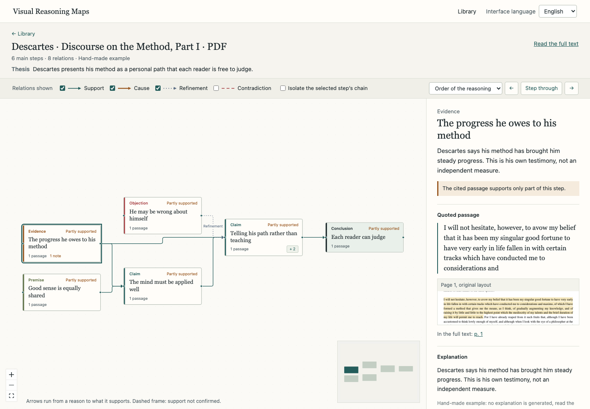
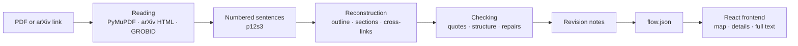

<div align="center">

# Visual Reasoning Maps

Maps of the reasoning in a scientific paper, with every step linked to the sentences it rests on.

[](https://github.com/YEKESONG/Visual_Reasoning_Maps/actions/workflows/ci.yml)
[](LICENSE)
[](pyproject.toml)
[](frontend/package.json)

**English** · [Français](README.fr.md) · [中文](README.zh-CN.md)

</div>



Visual Reasoning Maps is a research prototype built for an ENAC project. Given a paper (a PDF or an arXiv link), a language model reconstructs its argument: the question, premises, claims, evidence, objections and conclusions, and the relations between them. Every step and every relation cites the sentences of the paper it rests on, and an automatic check confirms that those sentences exist and actually support what is attributed to them. The app runs locally, with an interface in English, French and Chinese. The repository also contains a literature review written in French (`paper/`).

> [!NOTE]
> A map is a model’s reading of a text. “Checked” means the automatic check found that the quoted passage supports the step; it says nothing about whether the claim is scientifically sound.

## Contents

- [Features](#features)
- [Quick start](#quick-start)
- [Usage](#usage)
- [How it works](#how-it-works)
- [Configuration](#configuration)
- [HTTP API](#http-api)
- [Development](#development)
- [Docker](#docker)
- [Known limitations](#known-limitations)
- [Troubleshooting](#troubleshooting)
- [Contributing](#contributing)
- [License](#license)

## Features

- **Input**: a PDF (up to 30 MB and 400 pages) or an arXiv link. For arXiv papers, the HTML version is preferred over the PDF.
- **Layered map**: 5 to 12 main steps that expand into sub-steps, laid out left to right from reasons to conclusions. Four relation types (support, cause, refinement, contradiction) are told apart by color and line style.
- **Back to the source**: for a step, the quoted sentences, the excerpt in the original page layout and a link to the page; for a relation, both passages side by side.
- **Quote checking**: every step and every relation is marked Checked, Partly supported or Unconfirmed. Structural problems are written to a report.
- **Revision notes**: claims with no support, evidence that supports nothing, conclusions that go further than the cited material, contradictions worth a look.
- **Reading aids**: stepping through the map in the order of the reasoning or of the text, a full-text view with quoted passages highlighted, on-demand explanations of a step, keyboard navigation.
- **Three languages**: the interface is available in English, French and Chinese. The map language is chosen at upload; quotations stay in the language of the document.
- **Local data**: documents, maps and logs stay on your machine. Only the document text is sent to the model provider.

## Quick start

### Prerequisites

| Tool | Version | Notes |
|---|---|---|
| Python | 3.11 or later | 3.12 tested |
| Node.js | 22.13 or later | 24 tested; required by PDF.js 6 |
| pnpm | 11.19.0 | `npm install -g pnpm@11.19.0` |
| DeepSeek API key | — | Only needed to analyze your own documents |

Tested on macOS; CI runs the test suites on Ubuntu.

### Installation

```bash
git clone https://github.com/YEKESONG/Visual_Reasoning_Maps.git
cd Visual_Reasoning_Maps
bash scripts/setup.sh
```

`setup.sh` creates the `.venv` virtual environment, installs the Python dependencies from `requirements.lock`, creates `.env` from `.env.example` if it does not exist, then installs and builds the frontend. To choose the interpreter: `PYTHON_BIN=/path/to/python3.12 bash scripts/setup.sh`.

### Running

To analyze your own documents, put your key in `.env` (ignored by Git):

```dotenv
DEEPSEEK_API_KEY=your-key
```

Then start the server:

```bash
python3 run.py
```

The app is served at <http://localhost:8000>. The two examples (an excerpt from Descartes, as PDF and as HTML) open without a key.

> [!IMPORTANT]
> After updating the code (`git pull`), run `bash scripts/setup.sh` again, then restart the server. A server started before the update cannot read maps produced by the new version.

## Usage

### Analyzing a paper

1. On the **New map** page, upload a PDF or paste an arXiv link (`https://arxiv.org/abs/…`, `/html/…` or `/pdf/…`), then choose the **Map language**: same as the interface, same as the document, or a specific language.
2. Progress is shown stage by stage. You can close or reload the page: the analysis keeps running, and the map then appears in the **Library**.
3. Uploading a document again with the same map language opens its existing map, without new model calls.

On a 14-page, two-column paper, a full analysis took about 4 minutes, 26 model calls and USD 0.07 with `deepseek-flash` (LiteLLM estimate, September 2026). Every model call is cached: rerunning an interrupted analysis only redoes the calls that had not finished.

### Reading a map

- Only the main steps are shown at first; “+ n” reveals the n sub-steps of a step.
- Clicking a step opens the details panel: quoted sentences, the excerpt in the original layout, a link to the page, the “Explain this step” button, terms and revision notes. Clicking a relation shows both passages side by side.
- The toolbar hides a relation type, or fades everything outside the selected step’s chain.
- “Step through” walks through the steps in the order of the reasoning or in the order of the text.
- “Read the full text” opens the document with the quoted passages highlighted. Clicking a passage takes you back to its step; the rail on the right shows where the main steps sit in the text.
- Keyboard: Tab moves between steps, Enter opens one, Esc closes it.
- When no step is selected, the right-hand panel shows the legend (step types, relations, statuses).

### Languages

The selector at the top right switches the interface language, and the browser remembers the choice. The map language (steps, summaries, terms, revision notes) is chosen at upload. Quotations stay in the language of the document, and on-demand explanations follow the interface language. The same document analyzed in two languages gives two separate maps.

## How it works



1. **Reading.** For a PDF, PyMuPDF restores the column order, finds section headings from font size and weight, drops running headers, page numbers, formulas, tables and references, and rejoins sentences split across columns or pages. For arXiv, the HTML version is used when it exists, otherwise the PDF. If `GROBID_URL` is set, GROBID adds document structure. The text is then split into numbered sentences: `p12s3` is the third sentence of paragraph 12.
2. **Reconstruction**, in three passes: an outline of the main reasoning (5 to 12 steps), sub-steps section by section, then relations across sections. The first and last passes use DeepSeek’s thinking mode.
3. **Checking.** Every quote must be found in the sentences it points to. The structure is checked for cycles, isolated steps, branches that reach no conclusion, and conclusions with no premise or evidence upstream. A separate model call judges whether the sentences really support each step and each relation. Problems go back to the model at most twice, as targeted fixes; whatever remains doubtful is marked “Unconfirmed”.
4. **Revision notes**: structural rules plus the model’s remarks, each tied to a step and to sentences.

Each document gets its own folder, `data/<hash>/`, where the hash is the SHA-256 of the document and the map language:

| File | Contents |
|---|---|
| `source.pdf` or `source.html` | Original document |
| `parsed.json` | Paragraphs and numbered sentences, with their positions on the page |
| `flow.json` | The map: steps, relations, terms, metadata. Written last, so it marks a finished analysis |
| `validation_report.json` | Problems found and fixes applied |
| `suggestions.json` | Revision notes |
| `cache/`, `explanations/` | Model responses, one file per call; explanations requested from the interface |
| `llm_log.jsonl` | Tokens, duration, estimated cost and the cause of any failure; never the text or the key |

More detail in the [architecture](docs/ARCHITECTURE.md) and [design decisions](docs/DECISIONS.md) documents.

## Configuration

Settings are read from `.env` at startup; restart the server after changing them.

| Variable | Default | Purpose |
|---|---|---|
| `DEEPSEEK_API_KEY` | empty | DeepSeek key. Without it, only the examples are available. |
| `LLM_MODEL` | `deepseek/deepseek-flash` | Model name in LiteLLM’s `provider/model` form. |
| `LLM_API_BASE` | `https://api.deepseek.com/beta` | API endpoint. DeepSeek’s strict mode needs the beta endpoint; clear it for other providers. |
| `LLM_OUTPUT_MODE` | `strict` | `strict`: tool calls with a strict schema, falling back to JSON automatically if the provider rejects it. `json`: JSON output validated by Pydantic. |
| `LLM_THINKING_STAGES` | `skeleton,cross` | Passes that use DeepSeek’s thinking mode. |
| `LLM_THINKING_MAX_TOKENS` | `64000` | Output limit for those passes, reasoning tokens included. |
| `SECTION_CHUNK_CHARS` | `12000` | Characters of section text sent per batch. |
| `LABEL_LANGUAGE` | `auto` | Default map language: `auto` (the document’s), `fr`, `en`, `zh`. |
| `ANCHOR_THRESHOLD` | `85` | Minimum similarity (0 to 100) between a quote and the sentence it cites. |
| `GROBID_URL` | empty | Optional GROBID service, for example `http://localhost:8070`. |
| `EMBEDDING_MODEL` | empty | sentence-transformers model used to spot duplicate steps. The `sentence-transformers` package is installed separately. |
| `LANGFUSE_PUBLIC_KEY`, `LANGFUSE_SECRET_KEY`, `LANGFUSE_HOST` | empty, empty, `https://cloud.langfuse.com` | Optional: sends call metrics, without content, to Langfuse. |
| `DATA_DIR` | `data` | Where documents and results are stored. |

<details>
<summary>Advanced settings</summary>

| Variable | Default | Purpose |
|---|---|---|
| `PORT` | `8000` | Port used by `run.py` (an environment variable, not read from `.env`). |
| `MAX_UPLOAD_BYTES` | `31457280` | Largest PDF accepted (30 MB). |
| `MAX_INPUT_CHARS` | `180000` | Text sent to the model in one request; beyond that, each section is sampled. |
| `MAX_CHILDREN` | `8` | A step with more sub-steps than this is flagged. |
| `LLM_CONCURRENCY` | `3` | Model calls run in parallel. |
| `LLM_MAX_TOKENS` | `16000` | Output limit for passes without thinking mode. |

</details>

**Other providers.** For a model supported by LiteLLM (Anthropic, OpenAI, xAI…), set `LLM_MODEL` to its LiteLLM name, clear `LLM_API_BASE`, and add the key variable LiteLLM expects to `.env`, for example `OPENAI_API_KEY`. DeepSeek-specific thinking settings are only sent to DeepSeek. The code supports this switch, but it has not been tested with real accounts.

**Data.** The document text is sent to the configured provider. The source file, maps and logs stay in `DATA_DIR`; the logs never contain the text or the key.

## HTTP API

The FastAPI server exposes a JSON API. Interactive documentation is served at <http://localhost:8000/docs> and the schema at `/openapi.json`; the contract used by the frontend is versioned in [`frontend/openapi.json`](frontend/openapi.json).

| Method | Path | Purpose |
|---|---|---|
| `GET` | `/api/health` | Server status, configured model, whether a key is set |
| `POST` | `/api/tasks` | Starts an analysis: `multipart/form-data` (`file`, `language`) or JSON `{"arxiv_url", "language"}`. Returns 202 with a `task_id`, or with a `doc_id` if the map already exists |
| `GET` | `/api/tasks/{task_id}` | Latest status of an analysis |
| `GET` | `/api/tasks/{task_id}/events` | Progress, as Server-Sent Events |
| `GET` | `/api/docs` | Documents in the library |
| `GET` | `/api/docs/{doc_id}` | Parsed document: paragraphs, sentences, positions |
| `GET` | `/api/docs/{doc_id}/flow` | The map |
| `GET` | `/api/docs/{doc_id}/sentences` | Numbered sentences |
| `GET` | `/api/docs/{doc_id}/suggestions` | Revision notes |
| `GET` | `/api/docs/{doc_id}/source` | Source file |
| `POST` | `/api/docs/{doc_id}/steps/{step_id}/explanation` | Explanation of a step, in the language given by the `X-UI-Language` header |

`language` is one of `auto`, `fr`, `en` or `zh`; when it is omitted, `LABEL_LANGUAGE` applies. For example:

```bash
curl -F file=@article.pdf -F language=en http://localhost:8000/api/tasks
curl -N http://localhost:8000/api/tasks/<task_id>/events
```

## Development

### Repository layout

```text
Visual_Reasoning_Maps/
├── backend/
│   ├── app/
│   │   ├── ingest/        # PDF (PyMuPDF, GROBID) and arXiv HTML reading
│   │   ├── anchoring/     # sentence splitting and numbering
│   │   ├── llm/           # model calls, cache, log
│   │   ├── extraction/    # outline, sections, cross-links
│   │   ├── validation/    # quote and structure checks, repairs
│   │   ├── suggestions/   # revision notes
│   │   ├── prompts/       # instructions sent to the model
│   │   ├── models.py      # Pydantic models, the source of the API contract
│   │   └── main.py        # FastAPI app, also serves the frontend
│   └── tests/             # pytest suite, offline
├── frontend/
│   ├── src/               # React: library, map, details, full text
│   └── e2e/               # Playwright tests
├── examples/              # Descartes examples and their provenance
├── scripts/               # setup, development, examples, API contract
├── docs/                  # architecture, decisions, development log
├── paper/                 # literature review (LaTeX)
└── run.py                 # local launcher
```

### Development server

```bash
bash scripts/dev.sh
```

Starts the API on port 8000 with auto-reload, and Vite at <http://localhost:5173>, which forwards `/api` requests to the API.

### Checks

The same checks as CI:

```bash
.venv/bin/ruff check backend scripts run.py
.venv/bin/ruff format --check backend scripts run.py
.venv/bin/pytest -q
pnpm --dir frontend lint
pnpm --dir frontend test
pnpm --dir frontend build
```

The tests need neither network access nor an API key.

### End-to-end tests

```bash
pnpm --dir frontend exec playwright install chromium   # once
pnpm --dir frontend test:e2e
```

The server must be running, by default at <http://127.0.0.1:8000>; for another port, use `BASE_URL=http://127.0.0.1:8001 pnpm --dir frontend test:e2e`. These tests also regenerate the screenshots in `docs/screenshots/`.

### API contract

After changing the Pydantic models:

```bash
.venv/bin/python -m scripts.export_openapi
pnpm --dir frontend types
pnpm --dir frontend exec prettier --write src/api-schema.d.ts
```

CI fails if `frontend/src/api-schema.d.ts` no longer matches the schema.

### Examples and real calls

- `.venv/bin/python -m scripts.build_examples` rebuilds the Descartes examples in `examples/`; at startup, the server replaces outdated copies in `data/`.
- `.venv/bin/python -m scripts.record_fixtures article.pdf` records one real, billed model call in `data/`.

### Literature review

```bash
cd paper/etat_de_lart && make
```

Requires TeX Live or MacTeX with French language support. [paper/README.md](paper/README.md) lists what still needs to be checked.

### Documentation

| Document | Contents |
|---|---|
| [ARCHITECTURE](docs/ARCHITECTURE.md) | Modules, data flow, API |
| [DECISIONS](docs/DECISIONS.md) | Design decisions (ADRs) |
| [DESIGN](docs/DESIGN.md) | Interface design |
| [TECH_STACK](docs/TECH_STACK.md) | Dependencies and exact versions |
| [API_NOTES](docs/API_NOTES.md) | Verified behavior of third-party APIs |
| [DEVLOG](docs/DEVLOG.md) | A record of each development stage |
| [DEVELOPMENT_PROCESS](docs/DEVELOPMENT_PROCESS.md) | How to reproduce the build of the project |

Apart from the READMEs, the project documentation (`docs/`, `paper/README.md`, `examples/README.md`, `THIRD_PARTY_NOTICES.md`) is written in Chinese.

## Docker

```bash
docker compose up --build
```

The frontend is built inside the image; the app listens on `127.0.0.1:8000`, and `data/` is mounted from the host. To add GROBID, set `GROBID_URL=http://grobid:8070` in `.env`, then run:

```bash
docker compose --profile grobid up --build
```

These files are provided but have not been tested.

## Known limitations

- Scanned PDFs need OCR first.
- The page layout is reconstructed with rules. Two columns, headings and ruled tables are handled; tables without rules, three-column layouts and some floating figures may come out wrong. Formulas in a PDF are not converted to LaTeX; in HTML, MathML is kept.
- Automatic repairs do not always close a structural gap, such as a branch that never reaches the conclusion. Such gaps stay flagged in the report.
- The checker is the same model as the extractor, so human evaluation is still needed.
- Single process: a restart interrupts running analyses, whose finished calls stay in the cache. Do not run several workers (`uvicorn --workers`).
- Docker, GROBID, Langfuse, embeddings and providers other than DeepSeek are supported in the code but untested.

## Troubleshooting

**The page says “Cannot reach the server”.** The server is not running. Start `python3 run.py` and keep the terminal open.

**The page says “Server error”.** The cause is shown in the server’s terminal. After a code update, run `bash scripts/setup.sh` again and restart the server.

**Port 8000 is already in use.** `lsof -nP -iTCP:8000 -sTCP:LISTEN` shows which process holds it. No output means the port is free (lsof then exits with status 1, which is not an error). To use another port: `PORT=8001 python3 run.py`.

**“Set DEEPSEEK_API_KEY in .env and restart”.** Add the key to `.env`, then restart: the key is only read at startup.

**Key refused, no balance left, or too many requests.** These messages correspond to the provider’s 401, 402 and 429 responses. The provider’s response body is never shown or logged.

**“Too little text”.** The PDF is probably a scan: run OCR on it, then upload it again.

**“The model did not return a usable result at the … stage”.** Run the analysis again; calls that succeeded are read from the cache. The cause, without any content, is logged in `data/<hash>/llm_log.jsonl`.

**The map stays empty, or “The layout could not be computed”.** Reload the page.

**Analyzing a document again.** Move its folder out of `data/`, or choose another map language.

## Contributing

- Open an issue to report a problem or propose a change.
- One change is one stage: a commit in the [Conventional Commits](https://www.conventionalcommits.org/en/v1.0.0/) format with the stage number in the title (for example `[S22b]`), and an entry in [docs/DEVLOG.md](docs/DEVLOG.md) covering the problem, the change, the files and how it was checked.
- Run the [checks](#checks) before pushing, and add a test for any new behavior.
- Never commit `.env` or an API key.

## License

The code is released under the [MIT License](LICENSE). Dependencies and third-party material keep their own licenses; see [THIRD_PARTY_NOTICES.md](THIRD_PARTY_NOTICES.md) and [examples/README.md](examples/README.md). PyMuPDF is available under AGPL-3.0 or a commercial license: check compatibility before distributing a derived version.
