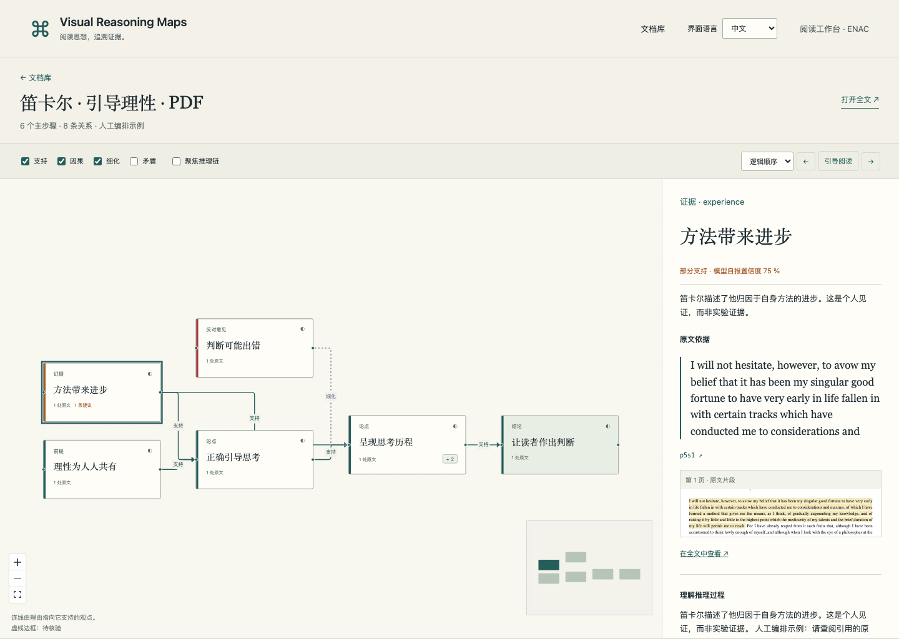
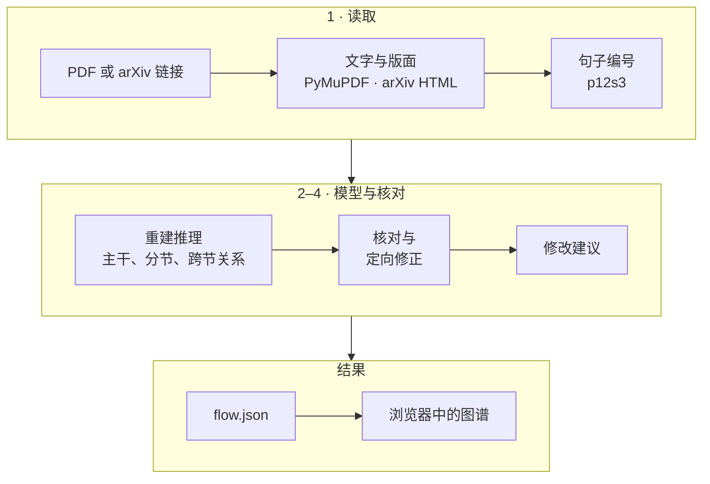

<div align="center">

# Visual Reasoning Maps

把论文的推理过程画成一张图，每一步都能回到原文中作为依据的句子。

[](https://github.com/YEKESONG/Visual_Reasoning_Maps/actions/workflows/ci.yml)
[](LICENSE)
[](pyproject.toml)
[](frontend/package.json)

[English](README.md) · [Français](README.fr.md) · **中文**

</div>



Visual Reasoning Maps 是为 ENAC 项目做的研究原型。输入一篇论文（PDF 或 arXiv 链接），大模型会重建其中的论证：研究问题、前提、论断、证据、异议、结论，以及它们之间的关系。每个步骤和每条关系都引用原文中作为依据的句子，程序会自动核对这些句子是否存在、是否真的支持对应的内容。应用在本机运行，界面有中文、英文、法文三种语言。仓库里还有一份法文文献综述（`paper/`）。

> [!NOTE]
> 图谱是模型对原文的一种读法。“已核对”只表示自动核对认为引文支持这一步，不代表这个论断在科学上成立。

## 目录

- [功能](#功能)
- [快速开始](#快速开始)
- [使用](#使用)
- [工作原理](#工作原理)
- [配置](#配置)
- [HTTP 接口](#http-接口)
- [开发](#开发)
- [Docker](#docker)
- [已知限制](#已知限制)
- [常见问题](#常见问题)
- [参与贡献](#参与贡献)
- [许可证](#许可证)

## 功能

- **导入**：PDF（不超过 30 MB、400 页）或 arXiv 链接。arXiv 论文优先使用 HTML 版本。
- **分层图谱**：5–12 个主步骤，可以展开子步骤，从左到右由依据指向结论。四种关系（支持、因果、细化、矛盾）用颜色和线型区分。
- **回到原文**：点开步骤，可以看到引用的句子、原始排版中的片段和页码链接；点开关系，可以并排对照两端的原文。
- **引文核对**：每个步骤和每条关系都标为已核对、部分支持或待核实；结构上的问题记录在报告里。
- **修改建议**：没有依据的论断、没有支持任何论断的证据、超出引文范围的结论、需要留意的矛盾。
- **阅读辅助**：按推理顺序或原文顺序逐步阅读；全文阅读时高亮被引用的句子；按需生成某一步的解释；支持键盘操作。
- **三种语言**：界面有中文、英文、法文。图谱语言在上传时选择，引文始终保留原文语言。
- **数据留在本机**：文档、图谱和日志都保存在本机，只有文档文字会发送给模型服务商。

## 快速开始

### 环境要求

| 工具 | 版本 | 说明 |
|---|---|---|
| Python | 3.11 及以上 | 已测 3.12 |
| Node.js | 22.13 及以上 | 已测 24；PDF.js 6 的要求 |
| pnpm | 11.19.0 | `npm install -g pnpm@11.19.0` |
| DeepSeek API 密钥 | — | 只在分析自己的文档时需要 |

在 macOS 上测试过；CI 在 Ubuntu 上运行测试。

### 安装

```bash
git clone https://github.com/YEKESONG/Visual_Reasoning_Maps.git
cd Visual_Reasoning_Maps
bash scripts/setup.sh
```

`setup.sh` 会创建虚拟环境 `.venv`，安装 Python 依赖（`requirements.lock`），在 `.env` 不存在时从 `.env.example` 复制一份，然后安装并构建前端。指定 Python 解释器：`PYTHON_BIN=/路径/python3.12 bash scripts/setup.sh`。

### 启动

要分析自己的文档，先在 `.env`（不会提交到 Git）中填写密钥：

```dotenv
DEEPSEEK_API_KEY=你的密钥
```

然后启动服务：

```bash
python3 run.py
```

浏览器打开 <http://localhost:8000>。两个示例（笛卡尔《谈谈方法》节选，PDF 和 HTML 各一份）不需要密钥就能查看。

> [!IMPORTANT]
> 更新代码（`git pull`）之后，先重新运行 `bash scripts/setup.sh`，再重启服务。更新前启动的服务读不了新版本生成的图谱。

## 使用

### 分析一篇论文

1. 在**新建图谱**页上传 PDF，或粘贴 arXiv 链接（`https://arxiv.org/abs/…`、`/html/…` 或 `/pdf/…`），然后选择**图谱语言**：与界面相同、与原文相同，或指定一种语言。
2. 页面会显示分析进行到了哪个阶段。期间可以关闭或刷新页面，分析不会中断，完成后图谱会出现在**文档库**里。
3. 同一份文档用同一种语言再次上传，会直接打开已有的图谱，不会再调用模型。

一篇 14 页的双栏论文，完整分析用时约 4 分钟，调用模型 26 次，使用 `deepseek-flash` 的费用约 0.07 美元（LiteLLM 估算，2026 年 9 月）。每次模型调用都有缓存：中断后重新分析，只会重做没有完成的调用。

### 怎么看图

- 默认只显示主步骤；“+ n”表示有 n 个子步骤，点击展开。
- 点击步骤，右侧显示详情：引用的句子、原始排版中的片段、页码链接、“解释这一步”按钮、术语和修改建议。点击连线，并排显示两端的原文。
- 工具栏可以隐藏某类关系，也可以淡化所选步骤推理链以外的内容。
- “逐步阅读”按推理顺序或原文顺序依次走过每一步。
- “阅读全文”打开原文，被引用的句子高亮显示。点击高亮的句子回到对应步骤；右侧竖条标出各主步骤在原文中的位置。
- 键盘：Tab 在步骤之间切换，Enter 打开，Esc 关闭。
- 没有选中步骤时，右侧面板显示图例（步骤类型、关系、核对状态）。

### 语言

右上角的选择框用来切换界面语言，偏好保存在浏览器中。图谱语言（步骤、摘要、术语、修改建议）在上传时选择。引文始终保留原文语言，按需生成的解释使用当前界面语言。同一份文档用两种语言分析，会得到两张独立的图谱。

## 工作原理



1. **读取文档。** PDF 由 PyMuPDF 处理：恢复双栏的阅读顺序，按字号和粗细识别章节标题，去掉页眉页脚、页码、公式、表格和参考文献，把被分栏或分页截断的句子接起来。arXiv 论文优先用 HTML 版，没有 HTML 时下载 PDF。设置了 `GROBID_URL` 时，由 GROBID 补充文档结构。全文切成带编号的句子，`p12s3` 表示第 12 段第 3 句。
2. **重建推理**，分三步：先给出主干推理（5–12 个主步骤），再逐节补充子步骤，最后找出跨章节的关系。第一步和第三步开启 DeepSeek 的思考模式。
3. **核对。** 每条引文都必须能在所标的句子里找到。程序会检查图的结构：环、孤立的步骤、没有通向任何结论的分支、上游没有前提或证据的结论。模型再单独判断这些句子是否真的支持对应的步骤和关系。发现的问题最多退回模型修改两轮，每次只改有问题的条目；仍然存疑的标为“待核实”。
4. **修改建议**：包括结构规则和模型意见，每条都挂在具体的步骤和句子上。

每份文档对应一个目录 `data/<哈希>/`，哈希是文档内容和图谱语言的 SHA-256：

| 文件 | 内容 |
|---|---|
| `source.pdf` 或 `source.html` | 原文件 |
| `parsed.json` | 段落和编号句子，以及它们在页面上的位置 |
| `flow.json` | 图谱：步骤、关系、术语、元数据。最后写入，表示分析已完成 |
| `validation_report.json` | 发现的问题和做过的修正 |
| `suggestions.json` | 修改建议 |
| `cache/`、`explanations/` | 每次模型调用的结果；按需生成的解释 |
| `llm_log.jsonl` | token 数、耗时、估算费用和失败原因；不记录正文和密钥 |

详见[架构](docs/ARCHITECTURE.md)和[技术决策](docs/DECISIONS.md)。

## 配置

配置在启动时从 `.env` 读取，修改后需要重启服务。

| 变量 | 默认值 | 作用 |
|---|---|---|
| `DEEPSEEK_API_KEY` | 空 | DeepSeek 密钥。没有密钥时只能查看示例。 |
| `LLM_MODEL` | `deepseek/deepseek-flash` | 模型名，LiteLLM 格式 `服务商/模型`。 |
| `LLM_API_BASE` | `https://api.deepseek.com/beta` | API 地址。DeepSeek 的严格模式需要 beta 地址；换其他服务商时清空。 |
| `LLM_OUTPUT_MODE` | `strict` | `strict`：带严格 schema 的工具调用，服务商不支持时自动改用 JSON。`json`：JSON 输出，由 Pydantic 校验。 |
| `LLM_THINKING_STAGES` | `skeleton,cross` | 开启 DeepSeek 思考模式的阶段。 |
| `LLM_THINKING_MAX_TOKENS` | `64000` | 这些阶段的输出上限，包含推理 token。 |
| `SECTION_CHUNK_CHARS` | `12000` | 逐节阶段每批发送的字符数。 |
| `LABEL_LANGUAGE` | `auto` | 图谱默认语言：`auto`（与原文相同）、`fr`、`en`、`zh`。 |
| `ANCHOR_THRESHOLD` | `85` | 引文与所标句子的最低相似度（0–100）。 |
| `GROBID_URL` | 空 | 可选的 GROBID 服务，例如 `http://localhost:8070`。 |
| `EMBEDDING_MODEL` | 空 | 用于识别重复步骤的 sentence-transformers 模型；`sentence-transformers` 需要另行安装。 |
| `LANGFUSE_PUBLIC_KEY`、`LANGFUSE_SECRET_KEY`、`LANGFUSE_HOST` | 空、空、`https://cloud.langfuse.com` | 可选：向 Langfuse 上报调用指标，不含内容。 |
| `DATA_DIR` | `data` | 文档和结果的存放目录。 |

<details>
<summary>高级设置</summary>

| 变量 | 默认值 | 作用 |
|---|---|---|
| `PORT` | `8000` | `run.py` 启动服务的端口（环境变量，不从 `.env` 读取）。 |
| `MAX_UPLOAD_BYTES` | `31457280` | 上传 PDF 的大小上限（30 MB）。 |
| `MAX_INPUT_CHARS` | `180000` | 一次发给模型的文字上限；超出时从每一节中截取一部分句子。 |
| `MAX_CHILDREN` | `8` | 子步骤超过这个数时，该步骤会被标记。 |
| `LLM_CONCURRENCY` | `3` | 同时进行的模型调用数。 |
| `LLM_MAX_TOKENS` | `16000` | 不开启思考模式的阶段的输出上限。 |

</details>

**换用其他服务商。** 对 LiteLLM 支持的模型（Anthropic、OpenAI、xAI 等），把 `LLM_MODEL` 改成它的 LiteLLM 名称，清空 `LLM_API_BASE`，并在 `.env` 中加入 LiteLLM 要求的密钥变量，例如 `OPENAI_API_KEY`。DeepSeek 专用的思考参数只发给 DeepSeek。代码已经支持这种切换，但没有用真实账号测试过。

**数据去向。** 文档文字会发送给所配置的服务商；原文件、图谱和日志都留在 `DATA_DIR` 中，日志不记录正文和密钥。

## HTTP 接口

FastAPI 服务提供 JSON 接口。交互式文档在 <http://localhost:8000/docs>，schema 在 `/openapi.json`；前端使用的接口契约保存在 [`frontend/openapi.json`](frontend/openapi.json)。

| 方法 | 路径 | 作用 |
|---|---|---|
| `GET` | `/api/health` | 服务状态、所用模型、是否已配置密钥 |
| `POST` | `/api/tasks` | 开始分析：`multipart/form-data`（`file`、`language`）或 JSON `{"arxiv_url", "language"}`。返回 202 和 `task_id`；图谱已存在时返回 `doc_id` |
| `GET` | `/api/tasks/{task_id}` | 分析任务的最新状态 |
| `GET` | `/api/tasks/{task_id}/events` | 分析进度，Server-Sent Events 格式 |
| `GET` | `/api/docs` | 文档库列表 |
| `GET` | `/api/docs/{doc_id}` | 解析结果：段落、句子、位置 |
| `GET` | `/api/docs/{doc_id}/flow` | 图谱 |
| `GET` | `/api/docs/{doc_id}/sentences` | 编号句子 |
| `GET` | `/api/docs/{doc_id}/suggestions` | 修改建议 |
| `GET` | `/api/docs/{doc_id}/source` | 原文件 |
| `POST` | `/api/docs/{doc_id}/steps/{step_id}/explanation` | 某一步的解释，语言由请求头 `X-UI-Language` 指定 |

`language` 可取 `auto`、`fr`、`en`、`zh`；不传时使用 `LABEL_LANGUAGE`。示例：

```bash
curl -F file=@article.pdf -F language=zh http://localhost:8000/api/tasks
curl -N http://localhost:8000/api/tasks/<task_id>/events
```

## 开发

### 目录结构

```text
Visual_Reasoning_Maps/
├── backend/
│   ├── app/
│   │   ├── ingest/        # 读取 PDF（PyMuPDF、GROBID）和 arXiv HTML
│   │   ├── anchoring/     # 切分并编号句子
│   │   ├── llm/           # 模型调用、缓存、日志
│   │   ├── extraction/    # 主干、分节、跨节关系
│   │   ├── validation/    # 引文与结构核对、修正
│   │   ├── suggestions/   # 修改建议
│   │   ├── prompts/       # 发给模型的提示词
│   │   ├── models.py      # Pydantic 数据模型，接口契约的来源
│   │   └── main.py        # FastAPI 接口，并托管前端
│   └── tests/             # pytest 测试，不联网
├── frontend/
│   ├── src/               # React：文档库、图谱、详情、全文
│   └── e2e/               # Playwright 测试
├── examples/              # 笛卡尔示例及来源说明
├── scripts/               # 安装、开发、示例、接口契约
├── docs/                  # 架构、技术决策、开发日志
├── paper/                 # 文献综述（LaTeX）
└── run.py                 # 本地启动入口
```

### 开发服务器

```bash
bash scripts/dev.sh
```

在 8000 端口启动带自动重载的后端，并在 <http://localhost:5173> 启动 Vite；Vite 把 `/api` 请求转发给后端。

### 检查

与 CI 相同：

```bash
.venv/bin/ruff check backend scripts run.py
.venv/bin/ruff format --check backend scripts run.py
.venv/bin/pytest -q
pnpm --dir frontend lint
pnpm --dir frontend test
pnpm --dir frontend build
```

测试不联网，也不需要 API 密钥。

### 端到端测试

```bash
pnpm --dir frontend exec playwright install chromium   # 只需一次
pnpm --dir frontend test:e2e
```

需要先启动服务，默认地址 <http://127.0.0.1:8000>；其他端口：`BASE_URL=http://127.0.0.1:8001 pnpm --dir frontend test:e2e`。这些测试也会重新生成 `docs/screenshots/` 中的截图。

### 接口契约

修改 Pydantic 模型之后：

```bash
.venv/bin/python -m scripts.export_openapi
pnpm --dir frontend types
pnpm --dir frontend exec prettier --write src/api-schema.d.ts
```

`frontend/src/api-schema.d.ts` 与 schema 不一致时，CI 会失败。

### 示例与真实调用

- `.venv/bin/python -m scripts.build_examples` 重新生成 `examples/` 中的笛卡尔示例；服务启动时会替换 `data/` 中过期的副本。
- `.venv/bin/python -m scripts.record_fixtures article.pdf` 会真实调用一次模型并产生费用，结果保存在 `data/`。

### 文献综述

```bash
cd paper/etat_de_lart && make
```

需要带法语支持的 TeX Live 或 MacTeX。待核实事项见 [paper/README.md](paper/README.md)。

### 文档

| 文档 | 内容 |
|---|---|
| [ARCHITECTURE](docs/ARCHITECTURE.md) | 模块、数据流、接口 |
| [DECISIONS](docs/DECISIONS.md) | 技术决策（ADR） |
| [DESIGN](docs/DESIGN.md) | 界面设计 |
| [TECH_STACK](docs/TECH_STACK.md) | 依赖和精确版本 |
| [API_NOTES](docs/API_NOTES.md) | 核实过的第三方 API 行为 |
| [DEVLOG](docs/DEVLOG.md) | 每个开发阶段的记录 |
| [DEVELOPMENT_PROCESS](docs/DEVELOPMENT_PROCESS.md) | 复现项目的搭建过程 |

## Docker

```bash
docker compose up --build
```

镜像内会构建前端；服务监听 `127.0.0.1:8000`，`data/` 挂载自宿主机。需要 GROBID 时，在 `.env` 中设置 `GROBID_URL=http://grobid:8070`，然后运行：

```bash
docker compose --profile grobid up --build
```

这些文件已经提供，但没有实际测试过。

## 已知限制

- 扫描版 PDF 需要先做 OCR。
- 版面靠规则还原：双栏、标题和带横线的表格可以处理；没有横线的表格、三栏版式和部分浮动体可能出错。PDF 中的公式不会转成 LaTeX；HTML 中的 MathML 会保留。
- 自动修正不一定能补上结构缺口（例如某条分支没有通向结论），这类问题会留在报告里。
- 核对用的是与抽取相同的模型，仍需要人工评价。
- 单进程运行：重启会中断正在进行的分析，已完成的调用保留在缓存中。不要用 `uvicorn --workers` 启动多个进程。
- Docker、GROBID、Langfuse、向量模型和 DeepSeek 以外的服务商都已提供支持，但没有实际测试过。

## 常见问题

**页面显示“连不上服务”。** 服务没有运行。运行 `python3 run.py`，并保持终端开着。

**页面显示“服务器出错了”。** 原因在运行服务器的终端里。如果刚更新过代码，重新运行 `bash scripts/setup.sh` 并重启服务。

**8000 端口被占用。** `lsof -nP -iTCP:8000 -sTCP:LISTEN` 会列出占用端口的进程；没有任何输出说明端口空闲（这时退出码为 1，不是出错）。换一个端口运行：`PORT=8001 python3 run.py`。

**提示“请在 .env 中填写 DEEPSEEK_API_KEY 并重启”。** 把密钥写进 `.env` 后重启服务，密钥只在启动时读取。

**密钥被拒、余额不足或请求过于频繁。** 这些提示分别对应服务商返回的 401、402 和 429。服务商返回的具体内容不会显示，也不会写入日志。

**提示“PDF 中几乎没有可提取的文字”。** 很可能是扫描件：先做 OCR 识别，再重新上传。

**提示“模型在……阶段没有返回可用结果”。** 重新分析即可，已经成功的调用会从缓存中读取。失败原因（不含正文）记录在 `data/<哈希>/llm_log.jsonl`。

**图谱一片空白，或提示“图谱排版失败”。** 刷新页面。

**想重新分析同一份文档。** 把它的目录移出 `data/`，或者换一种图谱语言。

## 参与贡献

- 发现问题或想提出修改，请开 issue。
- 一次修改就是一个阶段：一个 [Conventional Commits](https://www.conventionalcommits.org/zh-hans/v1.0.0/) 格式的提交，标题带阶段号（例如 `[S22b]`），并在 [docs/DEVLOG.md](docs/DEVLOG.md) 中记录问题、做法、涉及的文件和验证方式。
- 推送前运行[检查](#检查)，新行为要配测试。
- 不要提交 `.env` 或任何 API 密钥。

## 许可证

代码采用 [MIT](LICENSE) 许可证。依赖和第三方材料保留各自的许可证，见 [THIRD_PARTY_NOTICES.md](THIRD_PARTY_NOTICES.md) 和 [examples/README.md](examples/README.md)。PyMuPDF 采用 AGPL-3.0 或商业许可，分发衍生版本前请确认兼容性。
