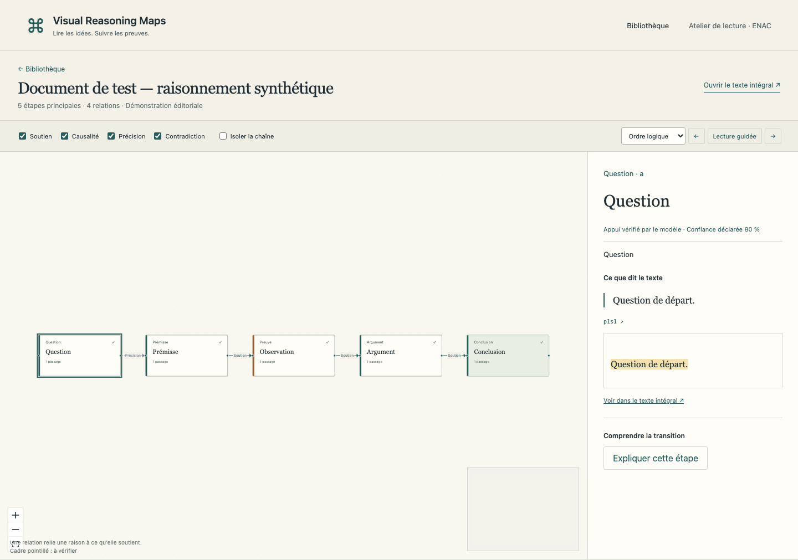

# Visual Reasoning Maps

本机运行的学术阅读原型：从 PDF 或 arXiv HTML 重建分层推理图，点击步骤或连线查看原文、解释和修改建议。法语界面；附法语综述初稿与中文过程文档。



## 安装与启动

要求 Python **3.12+**、Node.js **22+**（已测 24）、pnpm **11.19.0**、Git。锁定的当前依赖高于原始最低版本 3.11/20；必要时先 `npm install -g pnpm@11.19.0`。

```sh
git clone git@github.com:YEKESONG/Visual_Reasoning_Maps.git && cd Visual_Reasoning_Maps
bash scripts/setup.sh
python3 run.py
```

打开 **http://localhost:8000**。安装脚本创建 `.env`，不会覆盖已有配置。没有 key 也可浏览预置示例；分析新文件前，在 `.env` 填写 `DEEPSEEK_API_KEY` 并重启。不要把 key 发到聊天或提交 Git。可通过 `PYTHON_BIN=/路径/python3.12 bash scripts/setup.sh` 指定 Python。

## 使用

上传 PDF（最多 30MB）或 arXiv HTML 链接。处理后首屏显示主流程；+ 展开子步骤，勾选关系筛选或聚焦链，按逻辑顺序/原文顺序带读。节点和关系详情包含句子锚点、原版片段和建议。全文高亮可以点击返回图中对应步骤，右侧位置条展示观点沿原文的分布。

“已核验”仅指系统对原文支持程度的判断，不代表论文结论真实。虚线框表示待核实。Tab/Enter 操作节点，Esc 关闭选择。上传分析会把文本发送至所配置的 LLM，原文件与结果存储在本机。

## 配置与方案切换

- DeepSeek V4.1 Flash 对应 `LLM_MODEL=deepseek/deepseek-flash`；严格函数调用使用 beta URL；`LLM_OUTPUT_MODE=json` 可切换 JSON 模式。
- `LLM_THINKING_STAGES=skeleton,cross` 控制思考阶段；`LABEL_LANGUAGE=auto/fr/en/zh` 控制节点语言。
- 换 Claude/GPT/Grok：改 LiteLLM 模型前缀，清空或改写 `LLM_API_BASE`，设置该供应商环境密钥。没有实际账号的供应商未做真实验收。
- PDF 默认 PyMuPDF；配置 `GROBID_URL` 启用 TEI 结构增强。`docker compose --profile grobid up --build` 提供可选服务，容器内 URL 为 `http://grobid:8070`。
- `LANGFUSE_*` 可选，仅上报指标；`EMBEDDING_MODEL` 配合可选 sentence-transformers，否则回退字符串相似度。
- 更详细的默认决策与替代接口见 [DECISIONS](docs/DECISIONS.md)，技术版本见 [TECH_STACK](docs/TECH_STACK.md)。

## 开发与质量检查

`bash scripts/dev.sh` 启动后端与 Vite。`.venv/bin/pytest -q` 运行离线后端测试；`pnpm --dir frontend lint && pnpm --dir frontend test && pnpm --dir frontend build` 验证前端。测试不依赖网络和 API key。

使用 `.venv/bin/python -m scripts.export_openapi` 和 `pnpm --dir frontend types` 重新生成前端类型。`.venv/bin/python -m scripts.record_fixtures 文件.pdf` 会调用真实模型并产生费用，输出保存在忽略提交的 data/ 中。

## 项目结构与综述

`backend/` 后端、`frontend/` 前端、`examples/` 合法示例、`data/` 私有数据、`docs/` 过程文档、`paper/` 综述。

综述正文 `paper/etat_de_lart/main.tex`，七节独立文件、24 张阅读卡片。编译：`cd paper/etat_de_lart && make`（需要含法语支持的 TeX Live/MacTeX）。核实范围与待办见 [paper/README.md](paper/README.md)。

## 已知限制与排错

扫描 PDF 不做 OCR；多栏、公式、表格和切句需要人工检查。PDF 公式不转换 LaTeX，HTML 有 MathML/alttext 时保留。单进程后台任务不在重启后恢复，已完成结果保留；不要多 worker 启动。同内容结果按哈希复用，改配置重跑时先把该文档目录移出 data/。模型批评者不是独立真值，仍需人工评价。

无 key 时新任务提示配置；8000 已被占用可关闭旧实例或 `PORT=8001 python3 run.py`。Docker 文件已提供但本环境未实测。详细验证与尚未完成的外部验收见 [DEVLOG](docs/DEVLOG.md)。

## 许可证

本项目原创代码采用 MIT；第三方依赖与原文各自遵循其许可证。PyMuPDF 使用 AGPL/商业双许可，分发衍生版本时需考虑其要求。详见 [LICENSE](LICENSE)、[第三方声明](THIRD_PARTY_NOTICES.md) 与 examples/ 的来源说明。
