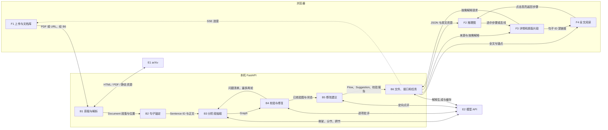

# 架构与数据契约

## 模块与流向



箭头按调用/数据边界标注；HTTP 入口都由 B6 承接，图中的 F1→B1 表示业务流。E1 只参与在线文档获取；示例阅读不会访问 E2。B4 重抽仍通过统一 LLMClient，次数固定不超过两轮。

| 模块 | 路径 | 职责 |
|---|---|---|
| F1 | `frontend/src/pages.tsx`, `api.ts` | 上传、链接、SSE、历史文档、法语错误 |
| F2 | `MapPage.tsx`, `graph.ts`, `layout.worker.ts`, `state.ts` | React Flow、ELK worker、层级、聚焦、带读、键盘 |
| F3 | `Details.tsx`, `SourceView.tsx`, `geometry.ts` | 原文引文、解释、术语、建议、PDF/HTML 片段与关系双端 |
| F4 | `FullText.tsx`, `SourceView.tsx` | 懒渲染全文、位置条、双向定位 |
| B1 | `backend/app/ingest/` | PyMuPDF、GROBID TEI、arXiv HTML/PDF 与资源缓存 |
| B2 | `backend/app/anchoring/sentences.py` | FR/EN 切句、句子 ID、行框或 DOM span |
| B3 | `backend/app/extraction/pipeline.py`, `prompts/` | 骨架、分节并发、跨节关系；ID 命名空间 |
| B4 | `backend/app/validation/checks.py` | 引文匹配、图约束、逐项批评、两轮修复、清理与报告 |
| B5 | `backend/app/suggestions/review.py` | 规则建议、LLM 建议和目标/来源过滤 |
| B6 | `main.py`, `storage/files.py`, `tasks/`, `llm/client.py` | REST、任务、SSE、哈希缓存、结构输出、调用指标 |
| E1 | `https://arxiv.org` | 外部论文资源；第三方字体不缓存 |
| E2 | `.env` 的 `LLM_MODEL`/`LLM_API_BASE` | 默认 DeepSeek；统一 LiteLLM 接口 |

## 契约、坐标与存储

`models.py` 是唯一后端类型来源。`scripts/export_openapi.py` 导出 `frontend/openapi.json`；openapi-typescript 生成 `src/api-schema.d.ts`。前端禁止自行复制业务类型。CI 检查生成文件漂移。

Sentence 使用稳定段落前缀 `p4s2`，`order` 表示文档内句序。PDF 页码从 1 起，框为旋转后显示页的左上原点、PDF point；PDF.js viewport 按显示页尺寸缩放，**不再次翻转 Y 轴**。每个句子可有多个行框。HTML 在原段落中插入 `data-sentence`，保留行内元素和 MathML。段落级 PDF 跨页句子尚不自动拼接。

Step 的 `parent=null` 表示主流程，子级只允许一层。关系从理由指向所支撑的步骤，contradict 不进入有向图。5–12 主步骤、最多 8 子步骤是校验目标，不是两轮修复后必然满足的保证。最终问题保留在报告及 `to_verify` 状态；`verified` 只表示系统认为引文支持该表述，不等于事实核验。`confidence` 是模型自报值，未校准。

```
data/{sha256}/
  source.pdf 或 source.html
  assets/
  parsed.json
  flow.json                 # 最后写入，完成标记
  validation_report.json
  suggestions.json
  explanations/{step_hash}.json
  cache/{request_hash}.json
  llm_log.jsonl
```

原始文件按内容哈希复用；单次模型请求另按完整输入和配置哈希。指标日志包含阶段、模型、耗时、token、可获得的成本估计，未记录原文/密钥。prompt、输出及原文本身存在本机缓存中；启用 Langfuse 仅上传调用指标。本机以外处理新文档会向所选模型供应商发送正文。

## HTTP 与任务状态

| 方法与路径 | 内容 |
|---|---|
| `GET /api/health` | 运行状态及 DeepSeek key 是否配置（不回传值） |
| `POST /api/tasks` | multipart `file` 或 JSON `arxiv_url`；返回 task_id，缓存命中则 doc_id |
| `GET /api/tasks/{id}/events` | SSE；支持 Last-Event-ID 重放；done/error 结束 |
| `GET /api/docs` | 只列有 flow.json 的已完成文档 |
| `GET /api/docs/{id}` | 解析结果、段落、句子和位置 |
| `GET /api/docs/{id}/flow` | 图、模式、生成元数据 |
| `GET /api/docs/{id}/sentences` | 句子集合 |
| `GET /api/docs/{id}/suggestions` | 修改建议 |
| `GET /api/docs/{id}/source` | 原始 PDF 或清洗、锚定后的 HTML |
| `GET /api/docs/{id}/assets/{name}` | 受限文件名的缓存资源 |
| `POST /api/docs/{id}/steps/{step}/explanation` | 单步解释，按需生成并缓存 |

进度为阶段刻度，不是剩余时间预测。后台任务由 asyncio 管理；按文档加锁避免同一结果并发写入。服务重启中断未完任务，但保留已生成文件和调用缓存。默认仅绑定 127.0.0.1，不提供认证、协作或持久任务队列。
